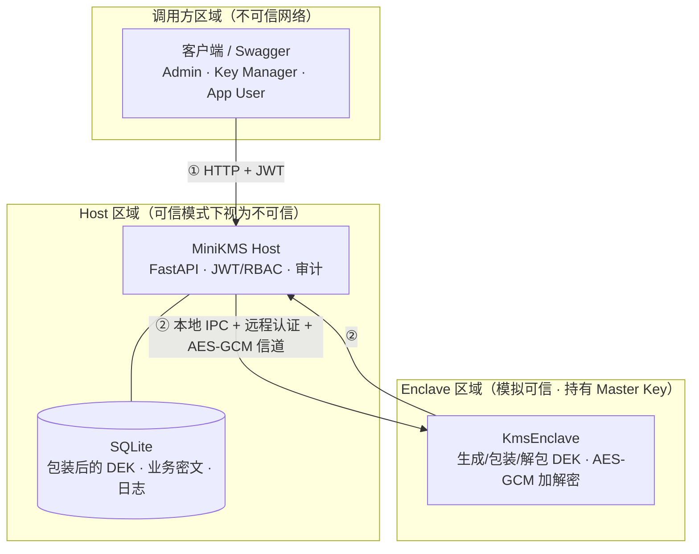

# 第 3 章 系统威胁模型与安全需求

> 初稿（draft）。本章基于现有原型代码撰写，所述机制均对应已实现功能。
> 系统边界：本文 Enclave 为**软件模拟可信执行环境（TEE）**，非 Intel SGX 等硬件隔离，亦非生产级 KMS。本章在描述防护能力的同时，明确区分"已实现的缓解"与"假设/不在防护范围内的威胁"。

## 3.1 威胁建模方法与本章组织

密钥管理系统的安全性不取决于单个密码算法的强度，而取决于密钥在其整个生命周期中是否始终处于受控状态。因此在进入具体设计之前，有必要先建立清晰的威胁模型，明确"在何种假设下、防护何种攻击者、达到何种安全目标"。本章采用面向资产的轻量级威胁建模流程，依次完成以下工作：

1. **资产识别**（3.2 节）：列出系统中需要保护的核心资产及其敏感级别。
2. **角色与信任边界**（3.3 节）：刻画系统参与方，划定信任边界，给出信任假设。
3. **攻击者模型**（3.4 节）：界定本文考虑的攻击者能力。
4. **威胁分析与缓解**（3.5 节）：逐项列出威胁，并对应到代码中已实现的缓解机制。
5. **明确不防护的威胁**（3.6 节）：诚实声明系统边界，避免过度表述。
6. **安全需求**（3.7 节）：从前述分析中导出可验证的安全需求清单。

需要说明的是，本章给出的是**设计级（design-level）威胁模型**，用于指导系统设计与测试，并非形式化的协议安全证明；形式化验证列入第 8 章的未来工作。在威胁分类的视角上，本章借鉴 STRIDE 中的信息泄露（Information Disclosure）、篡改（Tampering）、假冒（Spoofing）与权限提升（Elevation of Privilege）等维度，但以"资产—威胁—缓解"的工程化表格形式呈现，以便与具体实现一一对应。

## 3.2 资产识别

系统的安全设计围绕密钥层次展开。表 3-1 列出需要保护的核心资产、存放位置及敏感级别。其中，主密钥（Master Key）是整个信封加密体系的信任根，一旦泄露将导致所有数据加密密钥（DEK）及其保护的业务数据全部失陷，因此被列为最高敏感级别。

**表 3-1 关键资产清单**

| 编号 | 资产 | 存放位置 | 敏感级别 | 泄露后果 |
|------|------|----------|----------|----------|
| A1 | 主密钥 Master Key（L0，32 字节） | 仅 Enclave 进程内存（可信模式） | 极高 | 全部 DEK 与业务数据失陷 |
| A2 | 明文 DEK（L1，32 字节） | 仅在 Enclave 内临时存在 | 高 | 对应密钥下的业务数据失陷 |
| A3 | 包装后的 DEK（`encrypted_key_material`+`nonce`） | 数据库 | 中 | 仅在同时获得 Master Key 时才有价值 |
| A4 | 业务明文 / 业务密文 | 客户端 / 数据库 | 中 | 单条业务数据泄露 |
| A5 | 用户口令哈希、JWT 签名密钥 | Host（bcrypt 哈希 / 环境变量） | 高 | 身份冒充、令牌伪造 |
| A6 | 审计日志 | 数据库 | 中 | 抵赖、痕迹清除 |
| A7 | 会话密钥、Enclave 身份密钥 | Host/Enclave 进程内存（会话期间） | 高 | Host↔Enclave 信道被解密/冒充 |

按敏感级别排序，系统设计的首要目标是保护 A1 与 A2，即**让主密钥与明文 DEK 不出现在 Host 环境中**；这正是引入模拟 Enclave 的根本动机。

## 3.3 系统角色与信任边界

### 3.3.1 系统角色

系统涉及以下参与方：

- **调用方（Client）**：通过 HTTP 接口访问系统的用户或应用，凭 JWT 令牌鉴权，按角色分为 Admin、Key Manager、App User 三类（详见第 4 章权限矩阵）。
- **Host（MiniKMS）**：FastAPI 服务进程，负责用户鉴权、基于角色的访问控制（RBAC）、密钥元数据管理、审计日志，以及将敏感密码操作转发给 Enclave。在**可信模式**下，Host **不持有**主密钥，也不解包 DEK。
- **数据库（DB）**：默认 SQLite，保存用户、密钥元数据、包装后的 DEK、业务密文与审计日志，**不保存**主密钥与明文 DEK。
- **Enclave（KmsEnclave）**：模拟 TEE 的独立进程，持有主密钥，负责生成/包装 DEK、解包 DEK 并在内部完成 AES-GCM 数据加解密；明文 DEK 不离开 Enclave。
- **被动网络观察者 / 恶意运维**：本文将其作为潜在攻击者纳入考虑（详见 3.4 节）。

### 3.3.2 信任边界

系统存在两条关键信任边界，如图 3-1 所示：

- **边界①（调用方 ↔ Host）**：调用方位于不可信网络，必须通过 JWT 鉴权并受 RBAC 约束方可访问。
- **边界②（Host ↔ Enclave）**：这是本文威胁模型的核心边界。在可信模式下，Host 被视为**对密钥机密性而言不可信**，主密钥被隔离在边界另一侧的 Enclave 中；二者通过本地进程间通信（IPC）连接，并在其上叠加远程认证与 AES-GCM 加密信道。

**图 3-1 系统信任边界与数据流**

### 3.3.3 信任假设

本章威胁模型建立在以下假设之上：

- **A-1（Enclave 相对可信）**：Enclave 进程未被攻破，其内存与执行流程不被外部读取或篡改。**此假设由模拟环境约定保证，而非硬件强制**——在真实部署中需由 SGX 等硬件 TEE 提供，本文以独立进程 + 主密钥仅注入 Enclave 的方式进行结构性模拟。
- **A-2（Host 可能被攻破）**：在可信模式下，允许 Host 进程被攻击者控制或其内存/环境变量被窥探；系统的设计目标是即便如此，主密钥与明文 DEK 也不落入攻击者之手。
- **A-3（数据库不可信）**：允许攻击者获得数据库文件的完整副本。
- **A-4（本地可信 IPC）**：Host 与 Enclave 部署于同一主机，二者通过环回（loopback）TCP 或 Unix Domain Socket 通信；本文假设攻击者无法在该本地信道的**握手阶段**进行主动中间人攻击（此假设的必要性见 3.5 节 T4 与 3.6 节的诚实说明）。
- **A-5（合法用户经鉴权）**：所有业务接口调用者均须持有有效 JWT，且其角色受 RBAC 约束。

需要强调，**本地模式**（`USE_ENCLAVE=false`）下主密钥位于 Host 的 `.env`，此时 Host 属于可信区，A-2 不成立。本地模式仅用于开发与对照实验，本章威胁模型以**可信模式为主要分析对象**，本地模式作为对照基线。

## 3.4 攻击者模型

综合上述资产与边界，本文考虑具备以下能力的攻击者：

- **C-1 数据库泄露**：读取数据库文件或导出全部表内容（对应 A-3）。
- **C-2 Host 进程窥探**：读取 Host 进程内存、环境变量与配置文件（对应 A-2）。
- **C-3 被动窃听**：监听调用方↔Host 网络流量，以及（在握手之后）Host↔Enclave 信道流量。
- **C-4 主动篡改/重放**：篡改或重放 Host↔Enclave 信道上的消息。
- **C-5 冒充 Enclave**：以伪造或错误版本的 Enclave 应答 Host 的连接请求。
- **C-6 越权调用**：以合法但低权限的身份（如 App User），尝试调用其无权访问的接口或越权操作密钥。

不在攻击者能力范围内的情形（如物理攻击、同时控制 Host 与 Enclave、对握手阶段的主动中间人等）统一在 3.6 节声明。

## 3.5 威胁分析与缓解措施

针对 3.4 节的攻击者能力，表 3-2 给出系统已实现的缓解机制，并标注对应的代码位置。

**表 3-2 威胁分析与缓解措施**

| 编号 | 威胁（攻击者能力） | 缓解机制 | 实现位置 |
|------|--------------------|----------|----------|
| T1 | C-1 数据库泄露 | DB 仅存储包装后的 DEK 与业务密文，不含主密钥、不含明文 DEK；销毁密钥时擦除包装材料 | `models/key.py`、`key_service.destroy_key` |
| T2 | C-2 Host 内存/环境窥探（可信模式） | 主密钥仅在 Enclave；Host 配置强制将 `master_key` 置空；DEK 解包与数据加解密均在 Enclave 内完成 | `config.py:validate_crypto_mode`、`crypto_service`、`enclave_client` |
| T3 | C-3 被动窃听（信道） | Host↔Enclave 会话采用 AES-256-GCM 加密；调用方↔Host 假设由部署层 TLS 保护（见 3.6） | `enclave.py:_send_secure/_recv_secure` |
| T4 | C-4 篡改/重放 | 信道消息带 GCM 认证标签（篡改即解密失败）+ 单调递增序列号 `seq`（重放即被拒） | `enclave_client.py`、`enclave.py` 的 `seq` 校验 |
| T5 | C-5 冒充 Enclave | 远程认证：Host 校验 Enclave 测量值（measurement），并以挑战-响应（HMAC）验证身份密钥 | `enclave_client._connect_and_attest_unlocked`、`enclave.handle_attestation` |
| T6 | C-6 越权调用 | JWT Bearer 鉴权 + RBAC；App User 仅能使用 active 密钥、不能创建/管理密钥；越权写入审计 | `utils/permissions.py`、各 `api/*.py` 的 `require_roles` |
| T7 | 身份凭证泄露 | 用户口令仅存 bcrypt 哈希；API 响应从不返回密钥材料、口令哈希或主密钥 | `utils/security.py`、各响应 schema |
| T8 | 解密错误旁路 | 解密/解包失败统一返回通用错误，不暴露内部异常细节 | `crypto_service`、`kms_enclave._handle_decrypt` |

下面对若干关键威胁补充说明，并**诚实标注其残余风险**：

**T2（Host 被攻破时的密钥保护）。** 可信模式下，即使攻击者完全控制 Host 进程，也无法直接读出主密钥或离线导出明文 DEK——这是本方案相对纯本地模式的核心安全增益。但必须指出其**残余风险**：在一个已建立的认证会话存续期间，被攻陷的 Host 可以继续向 Enclave 提交加解密请求，即 Enclave 对持有该会话的一方而言是一个"加解密预言机（oracle）"。因此本方案的保护边界应准确表述为——**主密钥不被窃取、无法离线/规模化解密历史数据**，而非"Host 被攻破后数据绝对安全"。会话或 Enclave 终止后，攻击者即丧失该能力。

**T4（远程认证的真实强度）。** 当前远程认证可有效拒绝**版本错误或测量值不匹配的 Enclave**：Host 通过比对 `measurement` 与预期值（`SHA256("trusted-kms-enclave-v1.0")`）来识别对端。但其密码学强度受模拟实现限制：身份密钥（`identity_key`）为**对称密钥且在握手阶段以明文传输**，会话密钥随后用该身份密钥加密下发。这意味着该认证**不能抵御能够观测并主动操纵握手过程的攻击者**——这与真实 SGX 中由硬件根证书背书的非对称远程认证存在本质差异。因此本文将其归类为**结构性模拟的远程认证**，并以假设 A-4（本地可信握手信道）作为其成立的前提；该限制在 3.6 节再次明确声明。

**T8（统一错误处理）。** 信封解包失败返回 "Key material cannot be used"，数据解密失败返回 "Decryption failed"，二者均不携带底层异常栈或密钥信息，避免攻击者借助差异化错误信息进行旁路推断。

## 3.6 明确不在防护范围内的威胁（系统边界）

为避免对原型系统能力的过度表述，本节明确声明以下威胁**不在**本文防护范围内。这些边界主要源于"软件模拟 TEE"这一根本定位。

**表 3-3 明确不在防护范围内的威胁**

| 编号 | 不防护的威胁 | 原因说明 |
|------|--------------|----------|
| N1 | 物理攻击、冷启动、总线探测 | 软件模拟，无硬件隔离与内存加密 |
| N2 | 硬件/微架构侧信道（时序、缓存、分支预测等） | 未做侧信道防护；不属本文主线 |
| N3 | Enclave 进程本身被攻破 | 模拟环境下 Enclave 为普通进程，主密钥驻留于普通进程内存，具备 root、调试器或内存转储（如 `gcore`、`/proc/<pid>/mem`）能力者可读取 |
| N4 | 同时控制 Host 与 Enclave 的攻击者（恶意运维/全机 root） | 双端皆失陷时，可在 Enclave 内完成解密，超出本模型 |
| N5 | 对远程认证握手的主动中间人 | 受 T4 所述对称明文身份密钥限制，依赖假设 A-4 的本地可信握手信道 |
| N6 | 调用方↔Host 的传输层加密（TLS） | 原型以 HTTP 运行；TLS 由部署层（反向代理）提供，未在原型中实现 |
| N7 | 令牌被盗后的即时吊销 | JWT 在有效期内有效，未实现刷新令牌与吊销列表；被盗令牌在过期前可用 |
| N8 | 细粒度/多租户密钥隔离 | 访问控制为角色级；任何已鉴权用户可使用任意 active 密钥加解密，无逐密钥 ACL 与租户隔离 |
| N9 | 拒绝服务（DoS）与可用性攻击 | 本文聚焦机密性与完整性，不以可用性为目标 |
| N10 | 供应链与依赖完整性 | 不在本文范围 |

此外，本文亦不声称已对协议进行形式化安全证明（列入未来工作）。在实现细节上需补充说明：基类 `Enclave` 虽提供了"加密内存（SecureMemory）"与"密封存储（SealedStorage）"等抽象，但 KMS 的主密钥路径并未经由加密内存存放，而是以普通进程内存中的密钥对象形式持有；Enclave 在用完明文 DEK 后会将局部变量重置为零值，这属于**尽力而为的清零**，受 Python 运行时（不可变 `bytes` 与垃圾回收机制）限制，并非保证性的内存擦除。上述说明与"模拟 TEE、非生产级 KMS"的定位一致。

## 3.7 安全需求

综合 3.2–3.6 节的分析，本文导出如下可验证的安全需求。其中 SR1–SR6 为核心需求，SR7–SR8 为支撑性需求；每条均标注其针对的威胁与在系统中的落实位置，便于在第 7 章进行验证。

**表 3-4 安全需求与落实位置**

| 编号 | 安全需求 | 对应威胁/资产 | 落实位置 |
|------|----------|---------------|----------|
| SR1 | 可信模式下，主密钥不得出现在 Host 的环境变量或进程内存中 | T2 / A1 | `config.py` 强制 `master_key=None`；加解密转发至 Enclave |
| SR2 | 每次数据加密使用新的随机 nonce（12 字节） | 机密性 / A4 | 加密路径调用 `os.urandom(12)` / `secure_random(12)` |
| SR3 | 解密失败返回统一错误，不泄露内部细节 | T8 | `crypto_service`、`kms_enclave._handle_decrypt` |
| SR4 | 密钥轮换后，旧版本仍可解密历史密文 | 可用性/正确性 | `KeyVersion` 版本表；`_load_active_key_version` |
| SR5 | 销毁密钥后擦除数据库中的（包装后）密钥材料 | T1 / A3 | `key_service.destroy_key` 置空当前与历史版本材料 |
| SR6 | 关键操作写入审计日志 | T6 / A6 | `audit_service.record_event`，覆盖登录、增删改查与越权 |
| SR7 | 接口访问遵循最小权限：按角色限制密钥管理与审计访问 | T6 | `utils/permissions.require_roles`、各路由依赖 |
| SR8 | Host↔Enclave 信道保证机密性、完整性并防重放 | T3/T4 | AES-GCM 会话加密 + `seq` 序列号校验 |

这些需求构成第 4 章系统设计的约束，也是第 7 章测试用例的设计依据。需注意 SR1、SR8 的有效性以 3.3.3 节的信任假设（尤其 A-1、A-4）为前提；脱离这些假设（如 Enclave 被攻破、握手信道被主动操纵），相应保证不再成立。

## 3.8 本章小结

本章建立了系统的威胁模型与安全需求。首先识别了以主密钥为信任根的核心资产（表 3-1），随后刻画了系统角色与两条信任边界（图 3-1），其中 Host↔Enclave 边界是本文将主密钥隔离至模拟 Enclave 的关键所在。在此基础上，本章界定了攻击者能力，逐项分析了数据库泄露、Host 窥探、信道篡改、冒充 Enclave、越权调用等威胁，并对应到代码中已实现的缓解机制（表 3-2）。

更重要的是，本章以独立小节（3.6）诚实声明了系统边界：本文 Enclave 为软件模拟而非硬件 TEE，不防护物理攻击与侧信道，不防护 Enclave 自身被攻破或双端同时失陷，远程认证为结构性模拟、依赖本地可信握手信道，且访问控制为角色级而非多租户隔离。这一边界界定避免了对原型能力的夸大，也为第 4 章的设计取舍与第 8 章的未来工作提供了依据。最后，本章导出了 SR1–SR8 的安全需求清单（表 3-4），作为后续设计与测试的统一约束。
