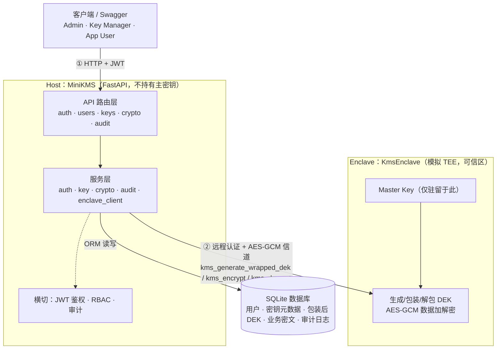
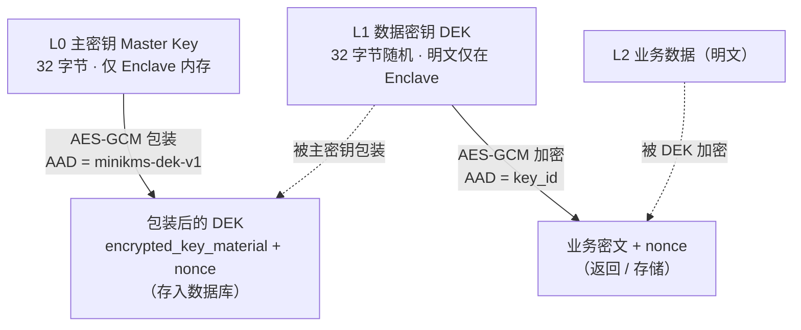
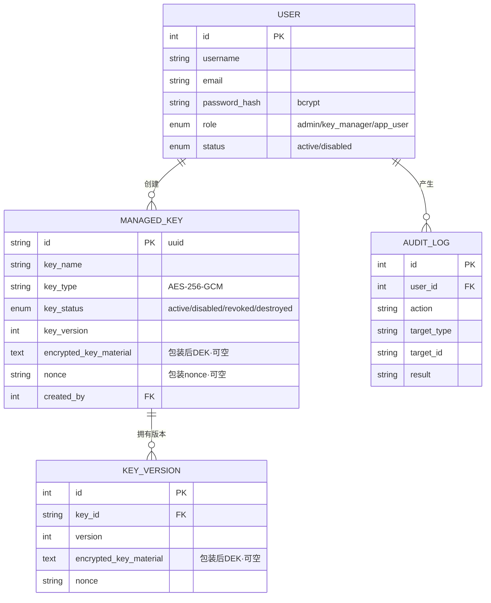
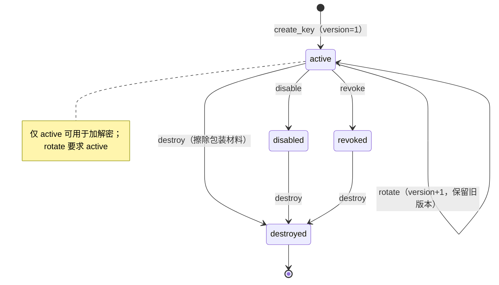

# 第 4 章 系统总体设计

> 初稿（draft）。本章描述系统的总体架构、密钥层次、模块划分、数据模型、API 与权限设计及密钥生命周期，均对应现有原型代码已实现的结构。
> 系统边界：Enclave 为软件模拟 TEE，非硬件 SGX，非生产级 KMS。涉及关键协议（远程认证、加解密时序）的细节在第 5 章展开，本章聚焦结构性设计。

## 4.1 设计目标与原则

依据第 3 章的威胁模型与安全需求（SR1–SR8），系统设计遵循以下原则：

1. **最小可信计算基（minimal TCB）**：将最敏感的密码操作——主密钥的持有、DEK 的包装/解包以及数据加解密——集中到尽可能小的可信组件（Enclave）中，使 Host 即便失陷也无法获得主密钥。这直接对应 SR1。
2. **信封加密分层（envelope encryption）**：采用"主密钥 → 数据密钥 → 业务数据"的三层结构，使主密钥仅用于包装少量 DEK 而不直接加密业务数据，从而降低主密钥的使用频率与暴露面。
3. **关注点分离（separation of concerns）**：Host 负责编排、鉴权、策略与审计（"谁能做什么"），Enclave 负责密码学执行（"如何安全地做"），二者通过受保护信道协作。
4. **纵深防御（defense in depth）**：在传输、鉴权、授权、加密、审计等多个层面叠加控制（JWT + RBAC + 信封加密 + 远程认证信道 + 审计日志），单点失效不致全局失陷。
5. **可对照、可降级**：提供本地模式与可信模式两种后端，前者作为开发与性能对照基线，后者为论文主方案，二者共享同一套 API 与数据模型。
6. **诚实边界**：设计上明确区分"硬件 TEE 能提供"与"软件模拟能提供"的能力，不以模拟实现冒充硬件隔离。

## 4.2 总体架构

系统采用 **Host + Enclave 分离**的三层架构，如图 4-1 所示。自上而下分别为调用方、Host（MiniKMS）与 Enclave（KmsEnclave），数据库由 Host 管理。

**图 4-1 系统总体架构**

各层职责如下：

- **调用方层**：通过 HTTP 访问 RESTful 接口，使用 Swagger 即可完成全部操作；所有业务请求携带 JWT 令牌。
- **Host 层（MiniKMS）**：基于 FastAPI 实现，包含 API 路由层与服务层。API 路由层暴露 `/auth`、`/users`、`/keys`、`/crypto`、`/audit` 等接口；服务层封装鉴权、密钥生命周期、加解密转发与审计逻辑；JWT 鉴权、RBAC 与审计作为横切关注点贯穿各接口。Host 管理 SQLite 数据库，但**在可信模式下既不持有主密钥，也不在本进程内解包 DEK**。
- **Enclave 层（KmsEnclave）**：作为独立进程运行，模拟 TEE。它持有主密钥，对外仅暴露三类受保护操作：生成并包装 DEK、加密、解密。明文 DEK 在 Enclave 内临时解包、用完即弃，不返回给 Host。

Host 与 Enclave 通过本地 IPC（环回 TCP 或 Unix Domain Socket）通信，并在其上叠加远程认证与 AES-GCM 加密信道（边界②，详见第 5 章）。这一架构使得"密钥策略"（在 Host）与"密钥材料"（在 Enclave）在物理上分置于不同进程，从而落实第 3 章的核心信任边界。

## 4.3 密钥层次与信封加密

系统采用三层密钥/数据层次，如图 4-2 与表 4-2 所示。其核心思想是信封加密：用主密钥"包装"数据密钥，再用数据密钥加密业务数据；数据库中只保存被包装后的 DEK 与业务密文，主密钥与明文 DEK 均不落盘。

**图 4-2 密钥层次与信封加密流程**

**表 4-2 密钥层次**

| 层级 | 名称 | 算法 / 长度 | 存放位置 | 关联数据（AAD） |
|------|------|-------------|----------|------------------|
| L0 | 主密钥 Master Key | AES-256 密钥 / 32 字节 | 仅 Enclave 进程内存（可信模式） | 包装 DEK 时使用 `minikms-dek-v1` |
| L1 | 数据密钥 DEK | 随机 32 字节 | 数据库中为密文（包装后） | 加密数据时使用 `key_id` |
| L2 | 业务数据 | AES-256-GCM 密文 | 客户端 / 数据库 | — |

设计上有两点值得说明。其一，**关联数据（AAD）的绑定作用**：包装 DEK 时以固定串 `minikms-dek-v1` 作为 AAD，使包装结果与用途绑定；加密业务数据时以 `key_id` 作为 AAD，使密文与具体密钥身份绑定，可防止跨密钥的密文混用。其二，**主密钥的低暴露**：主密钥仅参与 DEK 的包装/解包，不直接加密业务数据，且在可信模式下从不进入 Host，符合 SR1。

## 4.4 模块划分

系统按职责划分为若干模块，Host 侧与 Enclave 侧分列，对应文件如表 4-3 所示。模块边界清晰，便于第 6 章逐一说明实现，也便于在两种运行模式间复用。

**表 4-3 模块职责与对应文件**

| 模块 | 职责 | 主要文件 |
|------|------|----------|
| Auth（鉴权） | 注册、登录、签发/校验 JWT、口令哈希 | `api/auth.py`、`services/auth_service.py`、`utils/security.py` |
| Users（用户管理） | 管理员创建用户、查看用户列表 | `api/users.py`、`services/user_service.py` |
| Key Service（密钥生命周期） | 密钥元数据、创建/轮换/禁用/吊销/销毁 | `api/keys.py`、`services/key_service.py` |
| Crypto Service（加解密转发） | 按运行模式将加解密分派至本地后端或 Enclave | `api/crypto.py`、`services/crypto_service.py` |
| Enclave Client（Host 侧客户端） | 远程认证、安全信道、KMS 消息收发 | `services/enclave_client.py` |
| KmsEnclave（Enclave 服务端） | 持有主密钥，包装/解包 DEK，数据加解密 | `机密计算/src/kms_enclave.py`、`enclave.py`、`crypto.py` |
| Audit（审计） | 记录关键操作与结果 | `api/audit.py`、`services/audit_service.py`、`models/audit_log.py` |
| RBAC / 权限 | 基于角色的接口访问控制 | `utils/permissions.py` |
| 数据模型 | 用户、密钥、版本、审计的 ORM 定义 | `models/*.py` |
| 配置与启动 | 模式切换、Enclave 连接、健康检查、一键启动 | `config.py`、`main.py`、`start-trusted-kms.sh` |

其中，**Crypto Service 是模式无关性的关键**：上层 API 始终调用同一组加解密函数，由 Crypto Service 根据 `USE_ENCLAVE` 决定是在本进程内用主密钥解包 DEK 后加解密（本地模式），还是把请求转发给 Enclave（可信模式）。这使得两种模式对上层透明，也保证了数据模型与接口的一致性。

## 4.5 运行模式设计

系统支持两种运行模式，由环境变量 `USE_ENCLAVE` 切换，差异见表 4-4。配置加载时（`config.py` 的 `validate_crypto_mode`）会做一致性校验：当 `USE_ENCLAVE=true` 时，**强制忽略** Host 上可能残留的 `MASTER_KEY`（置空），确保主密钥不会在 Host 端被误用；当 `USE_ENCLAVE=false` 而又未配置 `MASTER_KEY` 时直接拒绝启动。

**表 4-4 本地模式与可信模式对比**

| 维度 | 本地模式（`USE_ENCLAVE=false`） | 可信模式（`USE_ENCLAVE=true`） |
|------|-------------------------------|-------------------------------|
| 主密钥位置 | Host 的 `.env` | 仅 Enclave 进程 |
| DEK 解包位置 | Host 内存 | Enclave 内存 |
| 数据加解密执行处 | Host 进程 | Enclave 进程 |
| 远程认证与加密信道 | 无 | 有 |
| 健康检查 `crypto_backend` | `local` | `enclave` |
| 适用场景 | 开发、单机、性能对照基线 | 论文主方案、演示可信密钥托管 |

两种模式共享同一套 API、数据模型与业务逻辑，仅密码学后端不同。这一设计的价值在于：一方面便于开发与调试（本地模式无需启动 Enclave），另一方面为第 7 章的性能对照实验（本地 vs. 可信，量化 Enclave IPC 开销）提供了直接基础。

## 4.6 数据存储设计

系统数据模型包含用户、受管密钥、密钥版本与审计日志四类实体，关系如图 4-3 所示。数据库默认采用 SQLite，核心代码不绑定其特有特性，便于后续迁移至 PostgreSQL。

**图 4-3 数据模型（ER 图）**

设计要点如下：

- **`ManagedKey`（受管密钥）**：保存密钥元数据与当前版本的包装后 DEK（`encrypted_key_material` 与 `nonce`）。关键在于数据库**只存包装后的 DEK，不存明文 DEK，更不存主密钥**，落实 SR1 与威胁 T1 的缓解。`encrypted_key_material` 与 `nonce` 设计为可空，是为支持销毁时擦除（置空）。
- **`KeyVersion`（密钥版本）**：以 `(key_id, version)` 唯一约束保存每一轮换版本的包装后 DEK，从而在轮换后仍可解密历史密文，落实 SR4。
- **`AuditLog`（审计日志）**：记录操作者、动作、目标类型与 ID、IP、User-Agent、结果与时间，支撑 SR6。
- **`User`（用户）**：口令仅保存 bcrypt 哈希；角色字段驱动 RBAC。

需注意，密钥"销毁"在本设计中表现为将相关行的包装材料字段置空（逻辑擦除），而非对底层存储介质的密码学粉碎；这一边界与第 3 章 N 系列声明一致。

## 4.7 API 设计与权限矩阵

系统对外提供 RESTful 接口，覆盖鉴权、用户管理、密钥生命周期、加解密与审计。访问控制基于 JWT + RBAC：未携带有效令牌的请求被拒（健康检查与注册/登录除外），需要管理权限的接口通过 `require_roles` 依赖限定角色。表 4-1 给出主要 API 与权限矩阵。

**表 4-1 主要 API 与权限矩阵**

| 方法 | 路径 | 允许角色 | 审计动作 | 涉及 Enclave 操作 |
|------|------|----------|----------|-------------------|
| GET | `/` | 公开 | — | —（健康检查显示后端状态） |
| POST | `/auth/register` | 公开 | —（首个用户自动为 Admin） | — |
| POST | `/auth/login` | 公开 | `login_success` / `login_failed` | — |
| GET | `/auth/me` | 任意已鉴权 | — | — |
| POST | `/users` | Admin | `create_user` | — |
| GET | `/users` | Admin | — | — |
| POST | `/keys` | Admin / Key Manager | `create_key` | `kms_generate_wrapped_dek` |
| GET | `/keys` | 任意已鉴权（App User 仅见 active） | `list_key_metadata` | — |
| GET | `/keys/{id}` | 任意已鉴权（App User 仅见 active） | `get_key_metadata` | — |
| POST | `/keys/{id}/rotate` | Admin / Key Manager | `rotate_key` | `kms_generate_wrapped_dek` |
| POST | `/keys/{id}/disable` | Admin / Key Manager | `disable_key` | — |
| POST | `/keys/{id}/revoke` | Admin / Key Manager | `revoke_key` | — |
| DELETE | `/keys/{id}` | Admin / Key Manager | `destroy_key` | — |
| POST | `/crypto/encrypt` | 任意已鉴权 | `encrypt` | `kms_encrypt` |
| POST | `/crypto/decrypt` | 任意已鉴权 | `decrypt` | `kms_decrypt` |
| GET | `/audit/logs` | Admin | — | — |

权限设计体现最小权限原则（SR7）：密钥的创建与生命周期管理仅限 Admin 与 Key Manager；审计日志与用户管理仅限 Admin；App User 只能查看 active 密钥的元数据并执行加解密，不能创建或管理密钥。越权访问会被 `require_roles` 拒绝（403）并写入 `permission_denied` 审计记录。

关于授权粒度需诚实说明：当前加解密接口对**任意已鉴权用户**开放，且不区分密钥归属——任何用户均可使用任意 active 密钥进行加解密。逐密钥 ACL 与多租户隔离不在本文范围（见第 3 章 N8），列入未来工作。

## 4.8 密钥生命周期设计

受管密钥具有明确的状态机，如图 4-4 所示。密钥创建后处于 `active` 状态，仅 `active` 状态可用于加解密与轮换；`disabled`、`revoked`、`destroyed` 状态均不可用于密码操作。

**图 4-4 密钥状态机**

各生命周期操作的设计如下：

- **创建（create）**：生成随机 DEK 并用主密钥包装，写入 `ManagedKey` 与第 1 版 `KeyVersion`；响应仅返回元数据，绝不返回密钥材料。
- **轮换（rotate）**：仅允许对 `active` 密钥操作。生成新版本 DEK，`key_version` 递增，并保留历史版本记录，使旧密文仍可凭其版本号解密（SR4）。
- **禁用 / 吊销（disable / revoke）**：将状态置为 `disabled` / `revoked`，使密钥不再可用于加解密；二者可对任何非 `destroyed` 密钥施加（为简洁起见，图 4-4 主要展示自 `active` 出发的路径）。
- **销毁（destroy）**：将状态置为 `destroyed`，并擦除当前版本与全部历史版本的包装后密钥材料（置空），落实 SR5；销毁为终态，不可再修改。

这一状态机配合 4.6 节的版本表，既保证了密钥可被安全地停用与销毁，又兼顾了轮换后历史数据的可解密性，在安全性与可用性之间取得平衡。

## 4.9 安全设计要点汇总

综合本章设计，系统的安全机制在多个层面落实第 3 章的安全需求：

- **机密性分层**：信封加密三层结构 + 主密钥仅驻留 Enclave（SR1）。
- **加密随机性**：每次数据加密使用新随机 nonce（SR2）。
- **信道安全**：Host↔Enclave 远程认证 + AES-GCM 会话加密 + 序列号防重放（SR8，详见第 5 章）。
- **访问控制**：JWT + RBAC，最小权限（SR7）。
- **审计可追溯**：关键操作与越权尝试均记录（SR6）。
- **稳健的错误处理**：解密失败统一返回通用错误（SR3）。
- **生命周期安全**：轮换保留历史版本（SR4）、销毁擦除材料（SR5）。

需要再次诚实标注两处实现边界，与第 3 章一致：其一，Enclave 在使用完明文 DEK 后会将局部变量重置为零值，但这是受 Python 运行时限制的尽力而为清零，非保证性的内存擦除；其二，主密钥在 Enclave 中以普通进程内存中的密钥对象形式持有，并未经由基类提供的"加密内存"抽象。这些都是"软件模拟 TEE"定位下的合理取舍。

## 4.10 本章小结

本章给出了系统的总体设计。围绕"最小可信计算基"与"信封加密分层"两条主线，确立了 Host + Enclave 分离的三层架构（图 4-1），使密钥策略与密钥材料在物理上分置；设计了主密钥—DEK—业务数据的三层密钥层次（图 4-2、表 4-2），保证数据库仅存包装后的 DEK 与业务密文。在此之上，本章给出了模块划分（表 4-3）、双运行模式（表 4-4）、数据模型（图 4-3）、API 与权限矩阵（表 4-1）以及密钥生命周期状态机（图 4-4），并逐项对应到第 3 章的安全需求 SR1–SR8。

本章的设计在结构层面回答了"如何在 Host 不可信的前提下隔离敏感密钥操作"的问题，同时如实标注了模拟实现的边界。其中涉及的关键协议——远程认证握手与加解密全链路时序——将在第 5 章详细展开。
